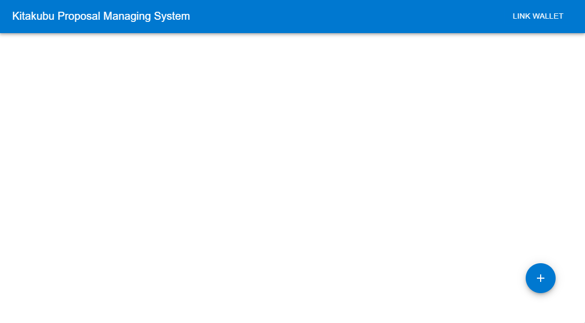
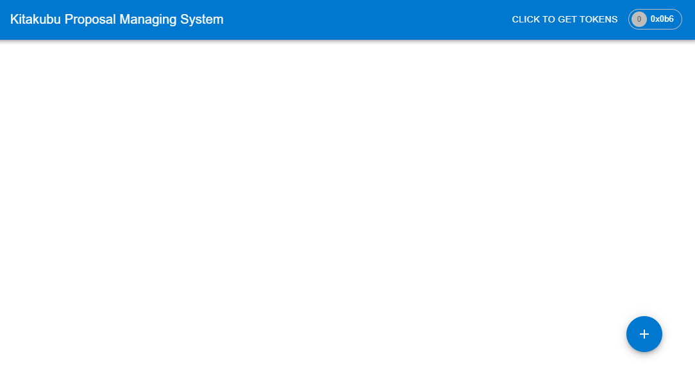
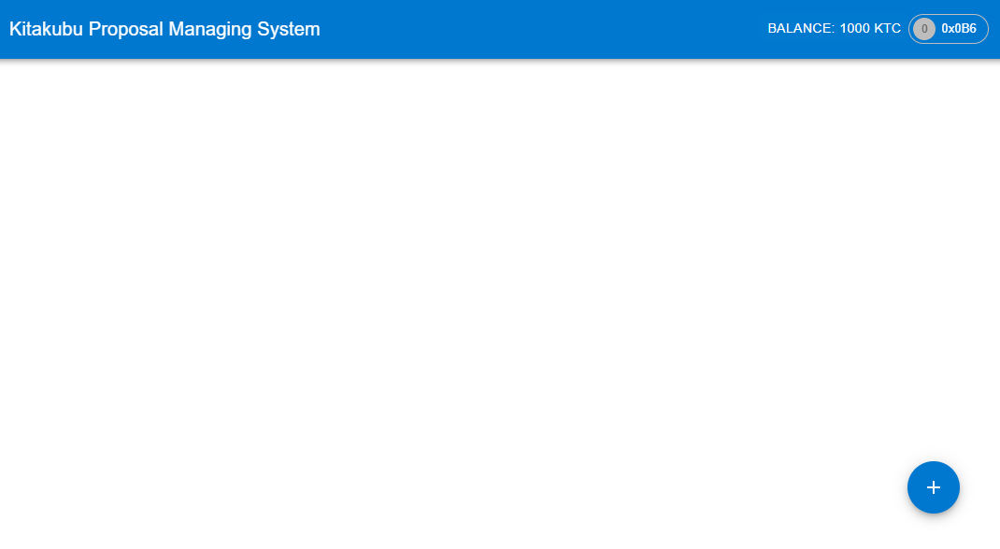
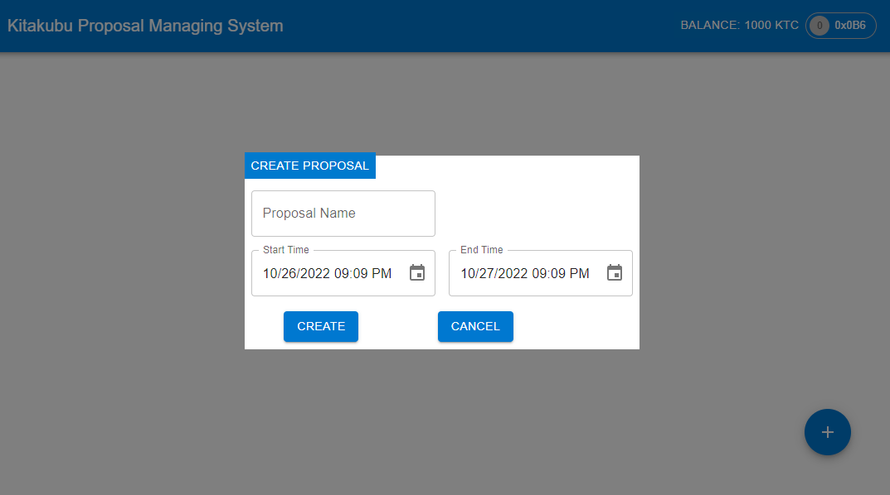
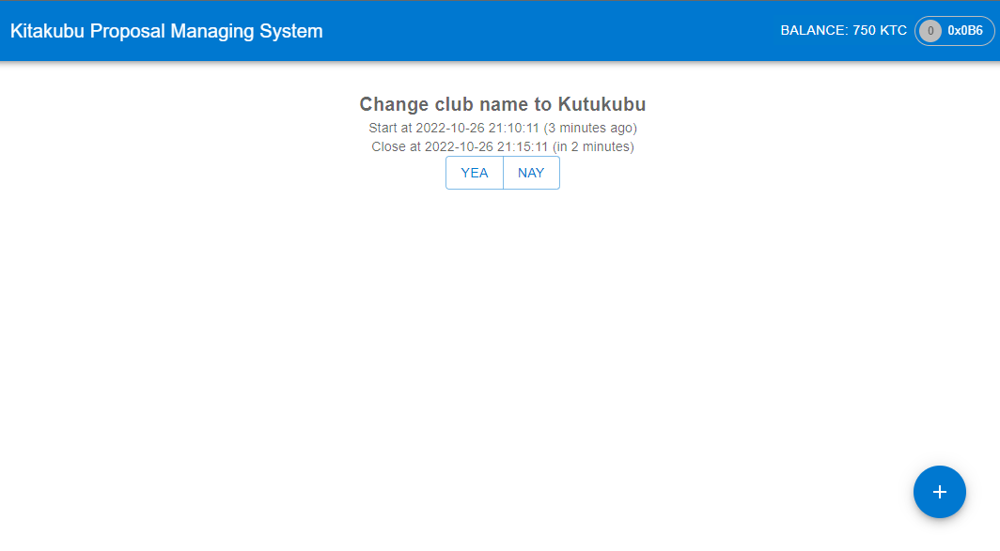
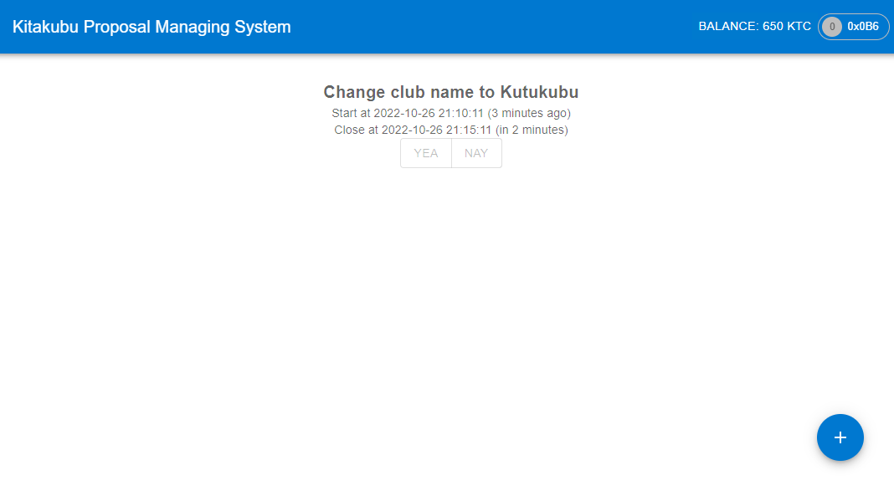
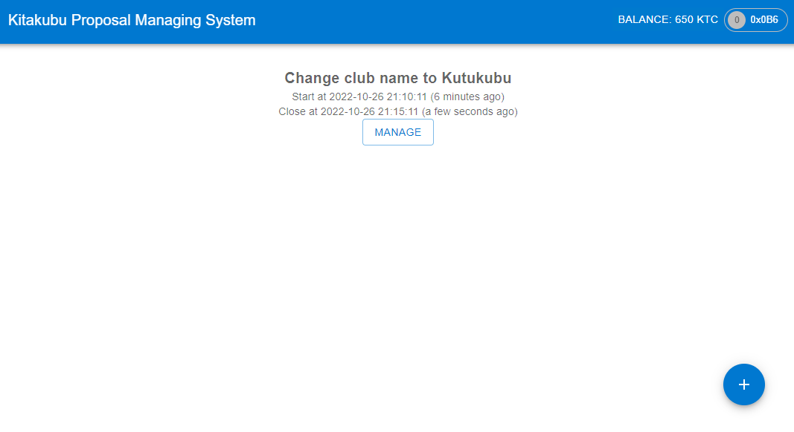
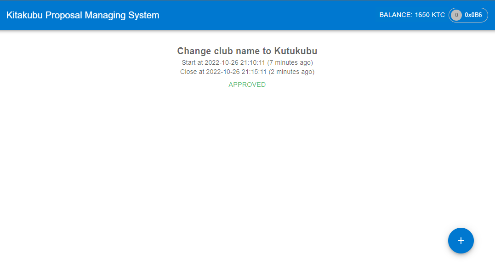
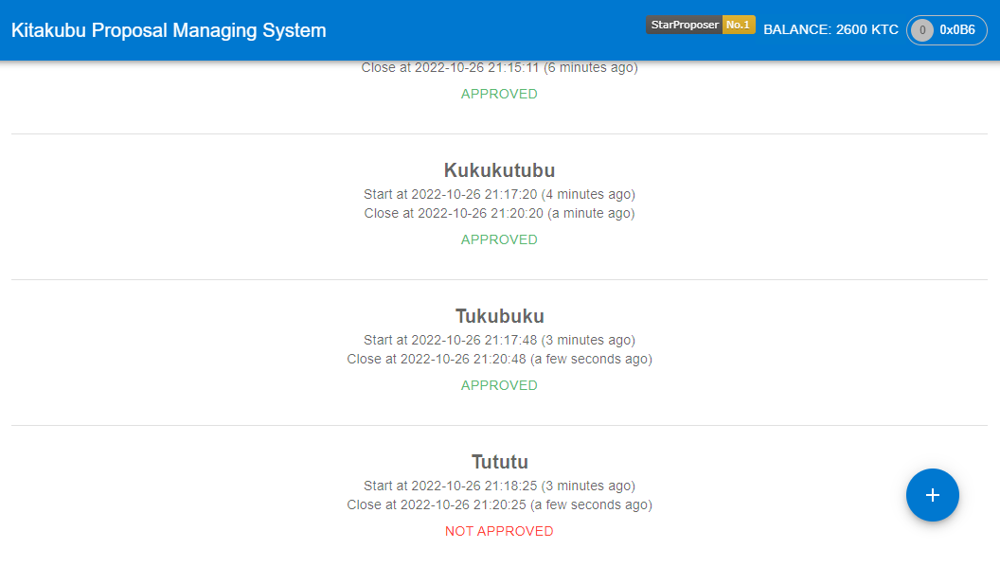

# Kitakubu Proposal Managing System

> 归宅部学生社团组织治理应用！ 
> 
> - 每个社员初始可以拥有或领取一些通证积分（ERC20）。 
> - 每个社员可以在应用中可以： 
>    1. 使用一定数量通证积分，发起关于该社团进行活动或制定规则的提案（Proposal）。 
>    2. 提案发起后一定支出时间内，使用一定数量通证积分可以对提案进行投票（赞成或反对，限制投票次数），投票行为被记录到区块链上。 
>    3. 提案投票时间截止后，赞成数大于反对数的提案通过，提案发起者作为贡献者可以领取一定的积分奖励。 
>    4. 发起提案并通过3次的学生，可以领取社团颁发的纪念品（ERC721）。

## 如何运行

1. 在本地启动ganache应用。

2. 在 `./contracts` 中安装需要的依赖，运行如下的命令：
    ```bash
    npm install
    ```
3. 在 `./contracts` 中编译合约，运行如下的命令：
    ```bash
    npx hardhat compile
    ```
4. 在 `./contracts` 中部署合约，运行如下的命令：
    ```bash
    npx hardhat run scripts/deploy.js --network localhost
    ```
5. 在 `./frontend` 中安装需要的依赖，运行如下的命令：
    ```bash
    npm install
    ```
6. 修改 `./frontend/src/address.json` 中的地址为部署后的地址
7. 在 `./frontend` 中启动前端程序，运行如下的命令：
    ```bash
    npm run start
    ```

## 功能实现分析

在这个章节我们主要通过前后端代码来解释各个功能的实现，我们使用 `solidity` 作为后端，并使用 `react` 作为前端框架，使用 `MUI` 和 `dayjs` 辅助界面的实现。

### 领取代币

1. 在 `erc.sol` 中定义自己的 `ERC20` 代币，定义了 `allowance` 接口，用于实现 `ERC20` 的授权转账功能。
   ```solidity
   contract MyERC20 is ERC20 {
        constructor(string memory name, string memory symbol) ERC20(name, symbol) {
            _mint(msg.sender, 1000000);
        }
        function allowance(address sender) external {
            _approve(sender, msg.sender, type(uint256).max);
        }
    }
   ```
2. 在主程序 `StudentSocietyDAO.sol` 中定义我们的代币 `KitakubuCoin`，然后定义了一个 `map` 用于表示用户是否领取过初始代币。
   ```solidity
    mapping(address => bool) public isInited;
   ```
3. 在前端我们会给没有领取过代币的用户提供一个领取代币的按钮，点击后会调用 `getFreeToken()` 领取代币。
    ```solidity
    function getFreeToken() external {
        // 判断是否得到过初始代币
        require(!isInited[msg.sender], "You have already got the token");
        // 一些状态的初始化
        members.push(msg.sender);
        approvedProposals[msg.sender] = 0;
        isInited[msg.sender] = true;
        // 转账
        studentERC20.transfer(msg.sender, INIT_TOKEN);
        studentERC20.allowance(msg.sender);
    }
    ```
4. 同时我们在前端会调用 `getBalance()` 来获取用户的代币余额。
    ```solidity
    function getBalance() external view returns (uint256) {
        return studentERC20.balanceOf(msg.sender);
    }
    ```

### 制定提案

1. 定义提案结构体，包含提案内容、投票开始时间、投票持续时间、提案人、提案序号、提案完成情况等信息。
   ```solidity
    struct Proposal {
        uint32 index;      // 提案序号
        address proposer;  // 提案人
        uint256 startTime; // 投票开始时间
        uint256 duration;  // 投票持续时间
        string name;       // 提案内容
        int32 isDone;      // 提案完成情况（-1：未完成，0：不通过，1：通过）
    }
   ```
2. 在前端读取用户输入内容，然后调用合约中的 `createProposal` 函数，传入提案内容、投票开始时间、投票持续时间等信息，调用成功后扣除相应的代币。
   ```solidity
    function createProposal(uint256 startTime, uint256 duration, string memory name) 
                            external returns(string memory) {
        // 判断余额是否符合
        require(studentERC20.balanceOf(msg.sender) >= PROPOSAL_TOKEN, "Token balance is insufficient");
        // 定义提案
        p = Proposal(idx, msg.sender, startTime, duration, name, -1);
        // 转账并记录提案状态
        studentERC20.transferFrom(msg.sender, address(this), PROPOSAL_TOKEN);
        proposals[p.index] = p;
        yeas[p.index] = 0;
        nays[p.index] = 0;
        idx++;
        // 调用合约创建事件
        emit ProposalInitiated(p.index);
        return "Create proposal success";
    }
   ```
3. 刷新页面，调用合约中的 `getProposal` 函数，传入提案序号，获取提案信息。
   ```typescript
    await mainContract.methods.proposals(proposalIndex).call();
   ```

### 投票
1. 我们定义了两个 `map` 用于储存特定提案的赞成票和反对票的数量，使用一个嵌套 `map` 用于表示用户对特定的提案是否进行过投票。
   ```solidity
    mapping(uint32 => uint32) yeas;
    mapping(uint32 => uint32) nays;
    mapping(address => mapping(uint32 => bool)) isVote;
   ```
2. 同时定义了一个 `vote()` 函数来对提案进行投票。
   ```solidity
    function vote(uint32 index, bool choice) external returns(string memory) {
        p = proposals[index];
        // 判断时间是否符合
        require(block.timestamp >= p.startTime && block.timestamp < p.startTime + p.duration, "Proposal has been closed");
        // 判断余额是否符合
        require(studentERC20.balanceOf(msg.sender) >= VOTE_TOKEN, "Token balance is insufficient");
        // 判断是否已经投过票
        require(!isVote[msg.sender][index], "Has been voted");
        // 扣除代币
        studentERC20.transferFrom(msg.sender, address(this), VOTE_TOKEN);
        // 记录投票
        if (choice)
            yeas[p.index]++;
        else
            nays[p.index]++;
        // 调用投票事件
        emit ProposalVoted(msg.sender, index, choice);
        // 设置投票状态
        isVote[msg.sender][index] = true;
        return "Vote success";
    }
   ```
3. 在前端，我们提供了两个按钮分别表示赞成和反对，点击按钮后调用合约中的 `vote()` 函数，传入提案序号和投票选项。
   ```typescript
    await mainContract.methods.vote(proposalIndex, <true/false>).send();
   ```

### 分发纪念品

1. 在 `souvenir.sol` 中定义了自己的纪念品非同质化代币。在这里我们使用了 [shields.io](https://img.shields.io/) 的牌子作为我们 NFT 的图标和 URI 。
   ```solidity
    contract MyERC721 is ERC721 {
        using Counters for Counters.Counter;
        Counters.Counter private _tokenIds;

        mapping (uint256 => string) private _tokenURIs;
        string head = "https://img.shields.io/badge/StarProposer-No.";
        string tail = "-yellow";

        constructor(string memory name, string memory symbol) public ERC721(name, symbol) {}
        // 分发 NFT
        function awardItem(address player) public returns(uint256) {
            _tokenIds.increment();

            uint256 newItemId = _tokenIds.current();
            _mint(player, newItemId);
            string memory tokenURI = string.concat(string.concat(head, Strings.toString(newItemId)), tail);
            _setTokenURI(newItemId, tokenURI);

            return newItemId;
        }

        function _setTokenURI(uint256 tokenId, string memory _tokenURI) internal virtual {
            require(_exists(tokenId), "ERC721Metadata: URI set of nonexistent token");
            _tokenURIs[tokenId] = _tokenURI;
        }
        // 得到 NFT 的 URI
        function getTokenURI(uint256 tokenId) view external returns(string memory) {
            return _tokenURIs[tokenId];
        }
    }
   ```
2. 在处理完成的提案时，我们会判断当用户通过的提案等于三个的时候，就会调用 `awardItem()` 函数，分发 NFT 给用户。
   ```solidity
    if (approvedProposals[p.proposer] == 3) {
        uint256 id = souvenir.awardItem(p.proposer);
        souvenirs[p.proposer] = id;
        emit haveSouvenir(p.proposer, id);
    }
   ```
3. 在前端，我们会调用 `getTokenURI()` 函数来获得 URI 然后展示在页面上。

### 处理提案
1. 在前端，当提案时间结束且没有处理时，投票按钮会变成处理按钮，点击后就会调用 `checkProposals()` 函数来处理所有的提案。
   ```solidity
    function checkProposals() external {
        uint32 i;
        // 遍历提案
        for (i = 0; i < idx; i++) {
            p = proposals[i];
            // 判断是否已经处理过
            if (p.isDone == -1 && block.timestamp > p.startTime + p.duration) {
                // 判断是否通过
                if (yeas[p.index] > nays[p.index]) {
                    emit ProposalApproved(p.index);
                    approvedProposals[p.proposer]++;
                    // 提案通过奖励代币
                    studentERC20.transfer(p.proposer, PROPOSAL_REWARD);
                    p.isDone = 1;
                    if (approvedProposals[p.proposer] == 3) {
                        uint256 id = souvenir.awardItem(p.proposer);
                        souvenirs[p.proposer] = id;
                        emit haveSouvenir(p.proposer, id);
                    }
                }
                else {
                    emit ProposalNotApproved(p.index);
                    p.isDone = 0;
                }
            }
            proposals[i] = p;
        }
    }
   ```

## 项目运行截图

1. 初始界面，由于此时没有提案，因此是一片空白，可以点击右上角的 Link Wallet 进行钱包链接。
   
2. 连接钱包后，可以在右上角看到自己的钱包地址前三位和领取代币按钮。
   
3. 领取后，右上角按钮变为剩余的代币数量。
   
4. 点击右下角加号，可以看到新建提案的界面。
   
5. 创建提案后就可以看到提案列表，其中包含提案名称、开始时间、结束时间和投票按钮。
   
6. 点击投票按钮即可进行投票，投完票后按钮变为灰色。
   
7. 当提案时间结束后，投票按钮变为处理按钮，点击后可以处理提案。
   
8. 处理完后，可以看到提案列表中的提案已经变为通过。
   
9. 当通过三个提案后，可以看到右上角出现了一个牌子，也就是我们的纪念品。
   

## 参考内容

[OpenZeppelin ERC721 文档](https://docs.openzeppelin.com/contracts/3.x/api/token/erc721)
[OpenZeppelin ERC20 文档](https://docs.openzeppelin.com/contracts/3.x/api/token/erc20)
[React Material UI 文档](https://mui.com/zh/material-ui/)
[Day.js 文档](https://day.js.org/docs/zh-CN/installation/installation)